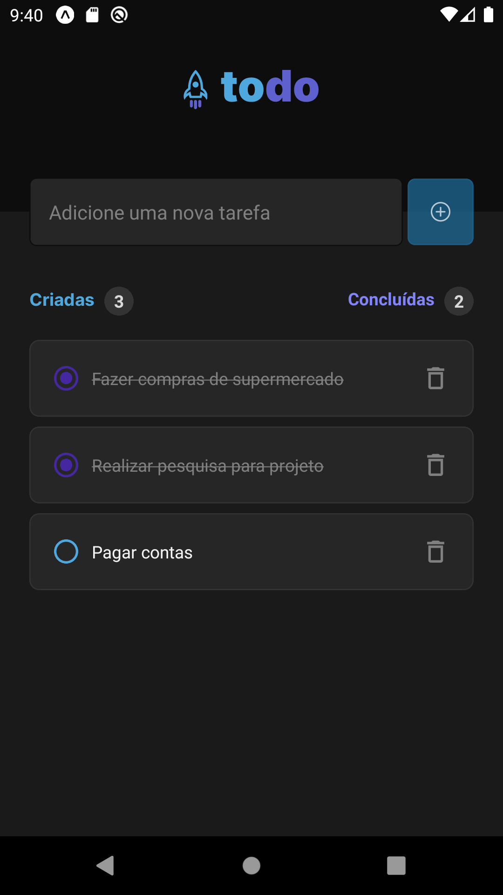

[VITE__BADGE]: https://img.shields.io/badge/Vite-B73BFE?style=for-the-badge&logo=vite&logoColor=FFD62E
[TYPESCRIPT__BADGE]: https://img.shields.io/badge/TypeScript-007ACC?style=for-the-badge&logo=typescript&logoColor=white
[REACT_NATIVE__BADGE]: https://img.shields.io/badge/React_Native-20232A?style=for-the-badge&logo=react&logoColor=61DAFB
[EXPO__BADGE]: https://img.shields.io/badge/Expo-1B1F23?style=for-the-badge&logo=expo&logoColor=white
[REACT__BADGE]: https://img.shields.io/badge/React-20232A?style=for-the-badge&logo=react&logoColor=61DAFB
[REACT_ROUTER__BADGE]: https://img.shields.io/badge/React_Router-CA4245?style=for-the-badge&logo=react-router&logoColor=white
[STYLED_COMPONENTS__BADGE]: https://img.shields.io/badge/styled--components-DB7093?style=for-the-badge&logo=styled-components&logoColor=white
[PROJECT__BADGE]: https://img.shields.io/badge/📱Visit_this_project-000?style=for-the-badge&logo=project
[PROJECT__URL]: https://github.com/Fernanda-Kipper/Readme-Templates

<h1 align="center" style="font-weight: bold;">Timer 💻</h1>

![react-native][REACT_NATIVE__BADGE]
![expo][EXPO__BADGE]
![typescript][TYPESCRIPT__BADGE]

  <a href="#-technologies">Technologies</a>&nbsp;&nbsp;&nbsp;|&nbsp;&nbsp;&nbsp;
  <a href="#-about">About</a>&nbsp;&nbsp;&nbsp;|&nbsp;&nbsp;&nbsp;

 

    
    

## Technologies

- React Native
- TypeScript
- Context API
- Expo
- Git e Github

## 📌 About

Este é um aplicativo para gerenciar tarefas do dia-a-dia.
